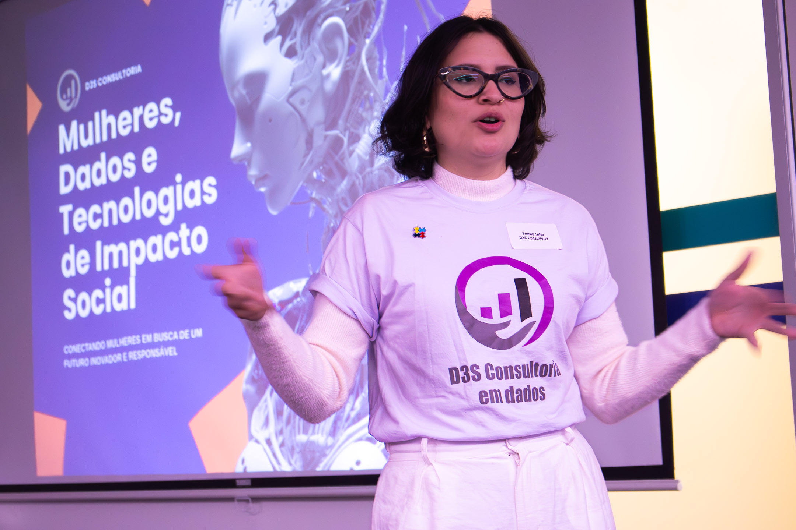

<!DOCTYPE html>
<html lang="en">
<head>
    <meta charset="UTF-8">
    <meta name="viewport" content="width=device-width, initial-scale=1.0">
    <title>Phirtia Silva | Portfolio</title>
    
</head>
<body>

    <!-- About the CEO Section -->
    <section id="about-ceo" class="container">
    

        
    

        <h1>About the CEO</h1>
        
<strong>LinkedIn:</strong> <a href="https://www.linkedin.com/in/phirtia-silva" target="_blank">Phirtia Silva</a>

        
Phirtia Silva is a Brazilian social and data scientist with a remarkable track record in public policy analysis, human rights, and digital transformation. She is the founder of D3S Consultoria, a nonprofit organization that promotes social impact across Brazil and Latin America through data-driven strategies and the use of social impact technologies within the Third Sector.

        
Throughout her career, Phirtia has worked across the public, private, nonprofit, and international sectors, contributing her expertise to high-impact projects on topics such as migration and refuge, LGBTQIAPN+ rights, child and youth protection, gender-based violence, and human trafficking—as well as various issues related to markets, industry, and consumer behavior.

        
Her approach combines rigorous data analysis with a deep understanding of social structures and community needs. A Social Sciences graduate, with a specialization in Data Science, Phirtia is currently pursuing a Master’s in Data Science for Public Policy at the London School of Economics. Her work has received both national and international recognition, and she is widely respected for her ability to transform complex realities into actionable insights that shape inclusive and equitable public policies.

        
At the heart of her work lies a simple belief: data can, and should, be used as a force for justice and systemic change.

    </section>

    <!-- Portfolio Section -->
    <section id="portfolio">
        

            <h2>Portfolio</h2>
            

                <!-- Project 1 -->
                

                    
                    

                        <h3>Governo | Government - Predictive Model</h3>
                        
Applying clustering and logistic regression techniques to predict the likelihood of re-victimization, return, or non-return to services dedicated to the protection of women victims of domestic violence and offered by the Municipal Secretariat for Human Rights and Citizenship of Sao Paulo.

                        <a href="#">Read More</a>
                    

                

                <!-- Project 2 -->
                

                    
                    

                        <h3>Tech NGO - Customer Segmentation</h3>
                        
Segmentation to capture different audience profiles, service needs, and to develop better communication, advocacy, and continuity strategies. Use of K-prototypes: an algorithm that considers both quantitative and qualitative data for clustering.

                        
<strong>Confidential</strong>

                    

                

                <!-- Project 3 -->
                

                    
                    

                        <h3>Human Rights NGO - Descriptive Analysis in a Complex Context</h3>
                        
Database analysis on victims of human trafficking for the purpose of forced criminality, including sensitive variables such as nationality, race/ethnicity, and human rights violations.

                        <a href="#">Read More</a>
                    

                

                <!-- Project 4 -->
                

                    
                    

                        <h3>Private Company - Priority Matrix</h3>
                        
Development of a Priority Matrix based on NPS survey data for a major industrial company, aiming to identify key areas for improvement and guide strategic decision-making. The analysis supported prioritization of customer pain points and aligned initiatives with user satisfaction and business impact.

                        
<strong>Confidential</strong>

                    

                

                <!-- Project 5 -->
                

                    
                    

                        <h3>Governo | Government - Geoprocessing of spatial and geographic data</h3>
                        
Conducted a geoterritorial study to identify the optimal location for implementing a new facility of the Municipal Secretariat for Human Rights and Citizenship, aimed at serving the LGBTQIA+ population in the city of São Paulo. The analysis combined spatial, demographic, and social vulnerability data to support inclusive and equitable public policy planning.

                        <a href="#">Read More</a>
                    

                

                <!-- Project 6 -->
                

                    
                    

                        <h3>Environmental NGO - Text Mining and Social Listening</h3>
                        
Performed social listening and text mining analysis for an NGO handling 50,000 annual cases focused on socio-environmental issues across Brazil. The study leveraged large-scale data from social media and client feedback to identify key trends, public sentiment, and emerging concerns, enabling the organization to tailor its strategies and improve community engagement nationwide.

                        
<strong>Confidential</strong>

                    

                

                <!-- Project 7 -->
                

                    
                    

                        <h3>Research Institutes - General Analysis Expertise</h3>
                        
Plan and coordinate quantitative and qualitative research projects, including the design and production of questionnaires, data tabulation, and index development. In-depth data analysis, UX/CX/BI experience, focus groups. Topics include illegal or irregular water use in favelas, electric vehicles, ESG indicators, KPI development, and studies across service/product sectors.

                        
<strong>Several Sources</strong>

                    

                

                <!-- Project 8 -->
                

                    
                    

                        <h3>Public and Third Sector - Monitoring and Evaluation</h3>
                        
Monitoring and evaluation of public policies and programs, with a focus on social impact and community engagement. Experience includes collaboration with D3S Consultoria and a tenure at the Secretaria Municipal de Direitos Humanos, contributing to the assessment and improvement of human rights initiatives.

                        
<strong>Confidential</strong>

                    

                

            

        

    </section>

</body>
</html>
